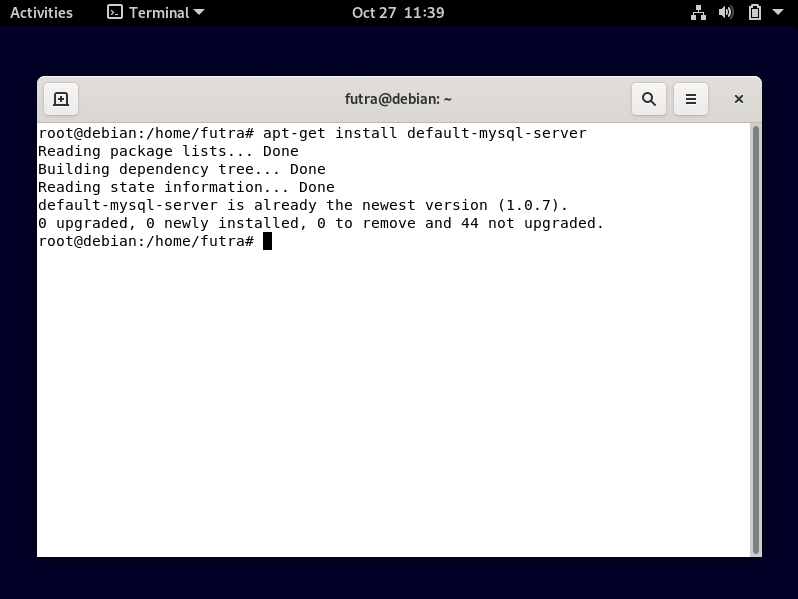
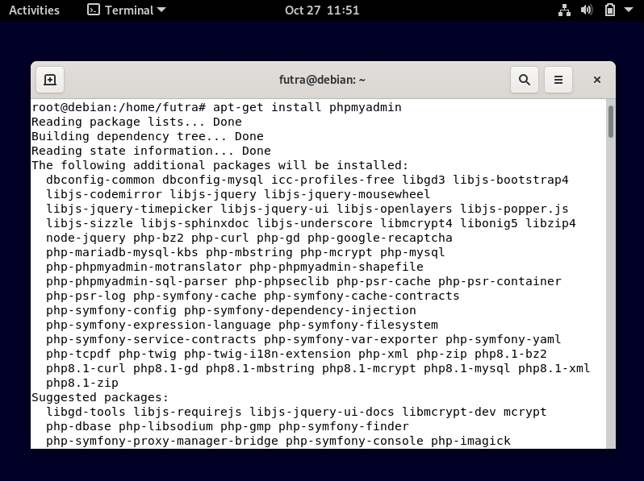
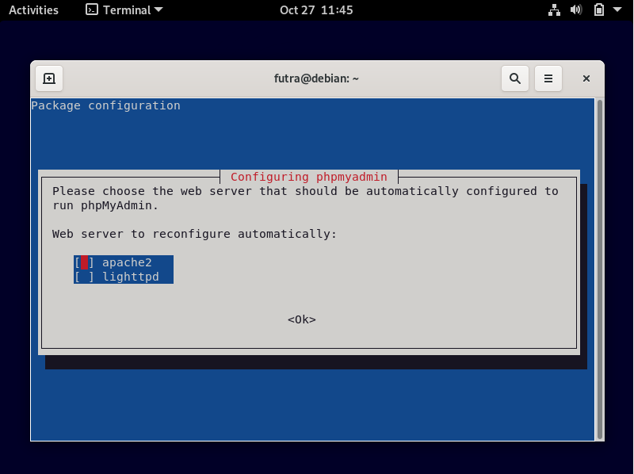
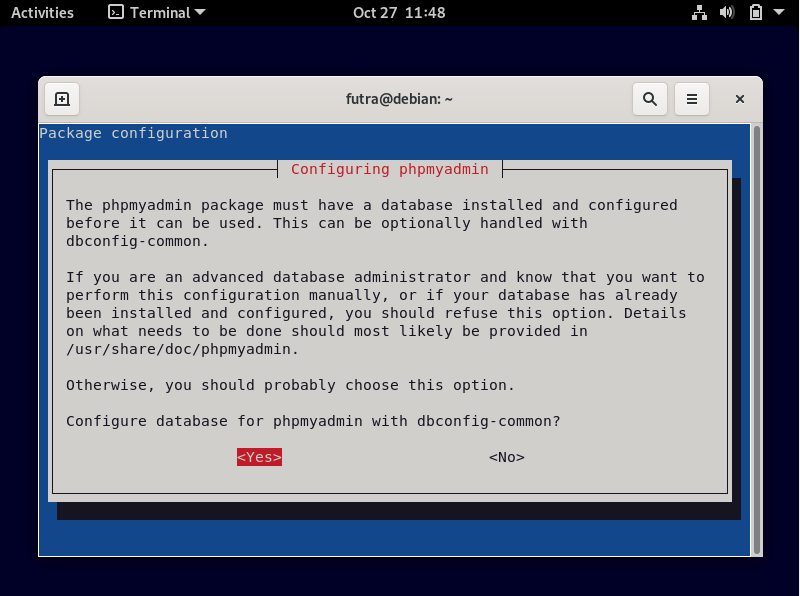
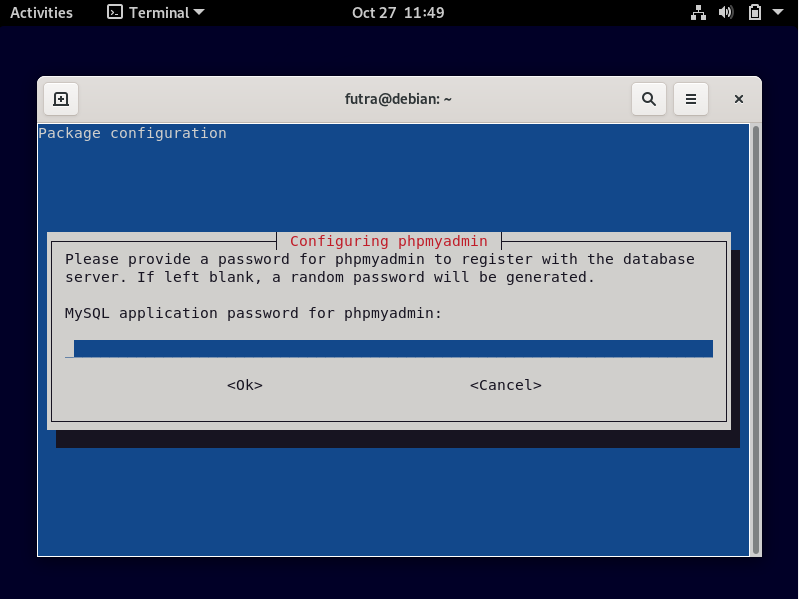
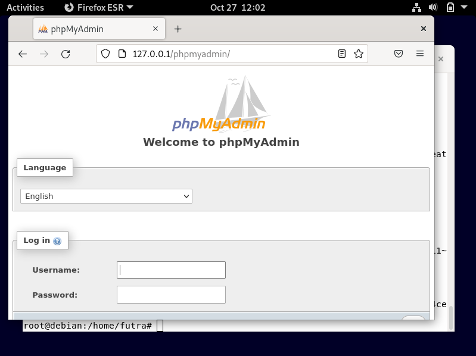

## FILE TRANSFER PROTOCOL (FTP)
> **Nama Kelompok:**
> 1. Futra S Hutasoit (2010131210002)
> 2. Muhammad Iman Rizqullah (2010131210017)
> 3. Muhammad Riza Nugroho (2010131210005)

**1. Instalasi**
+ Login ke debian dengan menggunakan user root dengan cara menjalankan command **su** atau **sudo -i** setelah itu jalankan command **apt-get install mysql-server** untuk menginstall database pada server kita, jika ada keterangan "Package 'mysql-server' has no installation candidate" coba jalankan command **apt-get install default-mysql-server**.

+ Jika sudah selanjutnya adalah menginstall phpmyadmin, aplikasi ini digunakan untuk memudahkan user yang tidak terbiasa dengan command line karena aplikasi ini menggunakan GUI. Untuk menginstallnya silahkan jalankan command **apt-get install phpmyadmin**. Pilih apache2 sebagai web server yang digunakan.

+ Pada form di bawah ini pilih Yes

+ Setelah itu kalian akan diminta untuk memasukkan root password dan konfirmasi password pada saat installasinya berjalan, saran saya buat semudah mungkin agar kalian tidak lupa pada saat ingin menggunakannya.

+ Selanjutnya adalah pengujian, Silahkan kalian buka browser dalam linuxnya lalu ketikkan alamat **(IP server kalian)/phpmyadmin**.

+ Isi dengan Username = root, Password = (password yang kalian masukkan pada saat installasi)
+ Selamat bagi anda yang sudah berhasil, untuk yang belum semangat untuk mencoba lagi.