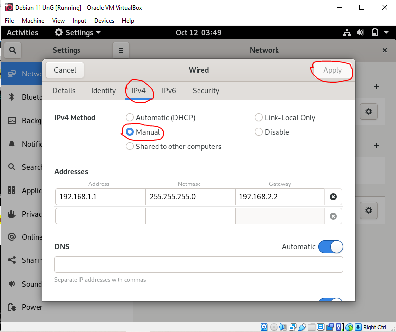

## FILE TRANSFER PROTOCOL (FTP)
> **Nama Kelompok:**
> 1. Futra S Hutasoit (2010131210002)
> 2. Muhammad Iman Rizqullah (2010131210017)
> 3. Muhammad Riza Nugroho (2010131210005)

**1. Instalasi**
+ Login ke debian dengan menggunakan user root dengan cara menjalankan command **su** atau **sudo -i** setelah itu kita setting IP untuk server terlebih dahulu, ikuti cara berikut

+ Jika sudah, restart IP dengan command **/etc/init.d/networking restart** atau restart manual dan cek IP sudah berhasil atau belum dengan perintah ip a.

+ Selanjutnya install bind9 pastikan anda terhubung dengan internet boleh dicek dengan menjalankan command **ping 8.8.8.8**, setelah itu jalankan command **apt-get install bind9** jika ada pertanyaan [y/n] klik y kemudian enter. Untuk memastikan instalisasi sudah berhasil jalankan command **apt-get install bind9** maka tampilannya akan seperti berikut

+ Kemudian masuk ke directory bind dengan command **cd /etc/bind** Berikut file-file penting yang akan kita konfigurasi dalam DNS Server
a. File forward
b. File reverse
c. named.conf.options
d. named.conf.local
e. /etc/resolv.conf 
+ Membuat file forward, file forward berfungsi untuk konversi dari DNS menjadi IP Address, misalnya www.futra.com melalui web browser, maka akan muncul website dari server debian. Caranya copy file db.local dengan command **cp db.local db.futra** kemudian konfigurasi file db.futra dengan command **nano db.futra**, Lakukan konfigurasi seperti gambar dibawah ini

+ Kemudian membuat file reverse, file reverse berfungsi untuk konversi dari IP Address menjadi DNS, misalnya jika kita mengetikkan ip address http://192.168.1.1 pada web browser, secara otomatis akan redirect ke alamat www.futra.com. Caranya copy file db.127 dengan command **cp db.127 db.192** kemudian konfigurasi file db.192 dengan command **nano db.futra**, Lakukan konfigurasi seperti gambar dibawah ini

+  Kemudian membuat Zone Domain. Edit tambahkan konfigurasi untuk forward dan reverse pada file named.conf.options dan named.conf.local. Langkah pertama kita konfigurasi pada file named.conf.options dengan command **nano named.conf.options** kemudian ubah konfigurasinya sepeti gambar dibawah ini yang diberi tanda merah. Kemudian langkah kedua kita konfigurasi named.conf.local dengan command **nano named.conf.local** kemudian tambahkan konfigurasinya seperti gambar dibawah ini yang diberi tanda merah.

+ Menambah dns-name server. Tambahkan dns dan nameserver dari server Debian tersebut pada file resolv.conf. agar dapat diakses melalui komputer kita. Jalankan command **nano /etc/resolv.conf** jika sudah selesai konfigurasi restart bind9 dengan command **/etc/init.d/bind9 restart** atau bisa di restart manual.

+ Sebelum melakukan pengujian DNS Server nya, kita install terlebih dahulu dnsutils dengan perintah apt-get install dnsutils. Jika ada pertanyaan [y/n] tekan y lalu enter. Kemudian lakukan pengujian dengan command **nslookup futra.com** dan **nslookup 192.168.1.1** jika berhasil maka akan seperti gambar dibawah ini.

+ Untuk pengujian selanjutnya bisa menggunakan command dig yang dilakukan pada local server. Silahkan jalankan command **dig futra.com** jika berhasil maka akan muncul seperti gambar dibawah
ini

+ Selamat bagi anda yang sudah berhasil, untuk yang belum semangat untuk mencoba lagi.