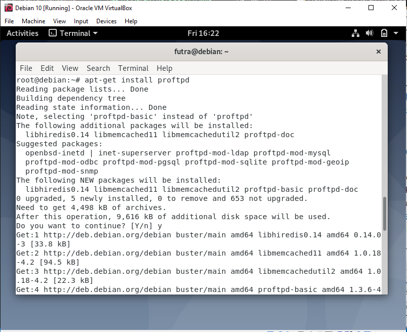
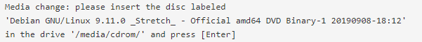
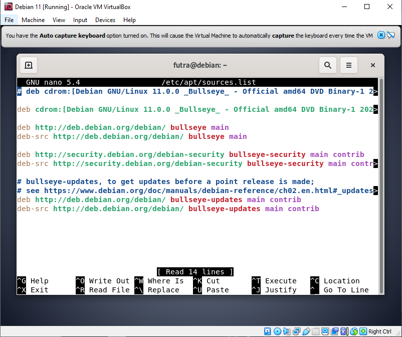
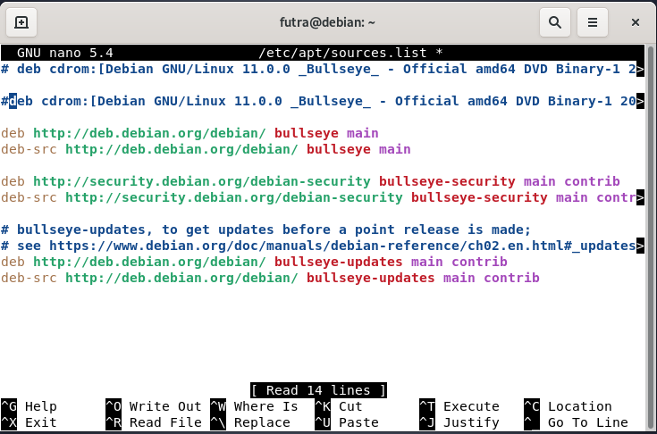
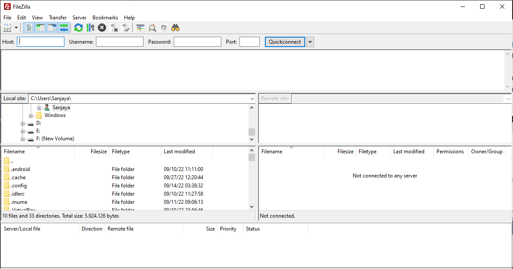
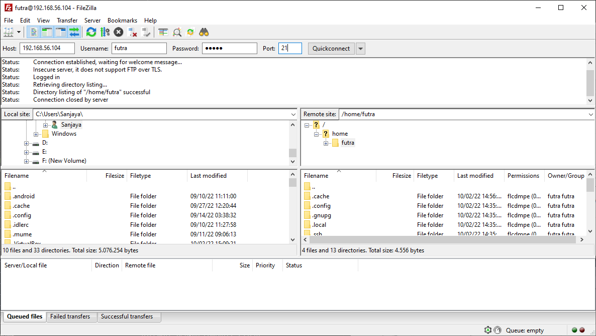
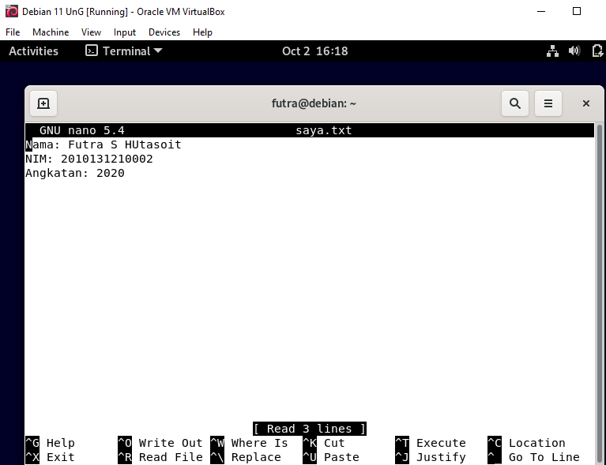
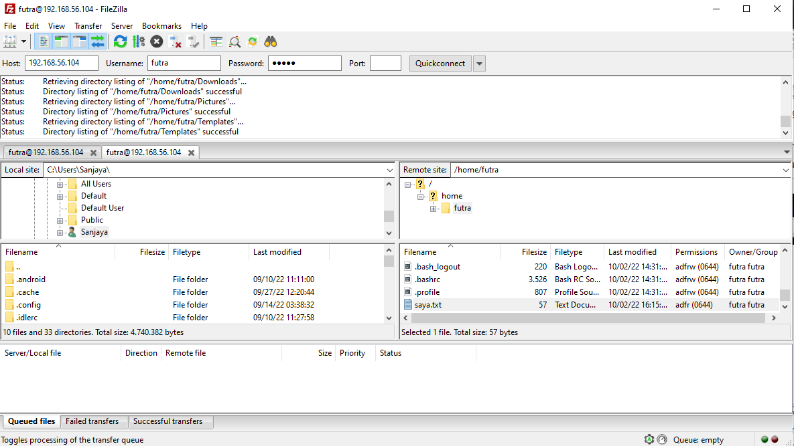

## FILE TRANSFER PROTOCOL (FTP)
> **Nama Kelompok:**
> 1. Futra S Hutasoit (2010131210002)
> 2. Muhammad Iman Rizqullah (2010131210017)
> 3. Muhammad Riza Nugroho (2010131210005)

**1. Instalasi**
+ Langkah pertama buka Debian kemudian masuk ke super user dengan command **su** dan masukkan password Linuxnya. Jika authentication failure silahkan menggunakan command **sudo -i** dan masukkan password Linuxnya.
+ Setelah berhasil masuk ke super user, silahkan install **proftpd** dengan menjalankan command **apt-get install proftpd**.

+ Jika anda mengalami masalah seperti pada gambar di bawah

+ silahkan menjalankan command **nano /etc/apt/sources.list**

+ kemudian tambahkan **#** di depan **deb cdrom** baris ke-2 atau bisa juga text pada baris ke-2 tersebut dihapus.

+ Simpan dan jalankan command **apt-get update** dan coba jalankan lagi command **apt-get install proftpd** untuk menginstall ulang.
+ Kali ini saya menggunakan settingan default yang ada pada aplikasi proftpd, namun jika anda membutuhkan konfigurasi pada FTP server anda, silahkan konfigurasikan pada file **/etc/proftpd/proftpd.conf.**
+ Selanjutnya pengujian pada proftpd, kali ini saya lakukan dengan menggunakan aplikasi **filezilla** yang akan diinstall pada computer client. Untuk itu silahkan download aplikasi tersebut pada <ins>https://filezilla-project.org/download.php</ins> jika sudah diinstall jalankan, maka tampilannya akan sebagai berikut:

**2. Testing**
+ Jalankan **filezilla** kemudian masukkan:
Host : Isi dengan IP address dari debian 
Username : Nama user di debian
Password : Password debian
Port : 21

kemudian klik quickconnect,  jika berhasil maka akan muncul seperti gambar dibawah ini. Perlu kalian ketahui bahwa sisi bagian kiri pada gambar dibawah merupakan sisi file local dari computer client kita sedangkan untuk sisi bagian kanan merupakan sisi server yaitu server yang menggunakan system operasi debian pada modul ini.

+ Sekarang kita akan membuat file pada computer server yang akan diletakkan pada folder **/home/futra**.
+ Lalu kita akan buat file .txt, untuk membuatnya jalankan command **nano saya.txt** kemudian isi ketik teks yang mau di masukkan.

kemudian simpan dan cek filenya apakah sudah ada dengan menggunakan command **ls**, atau bisa lihat di Remote site yang terdapat di Filezilla.

