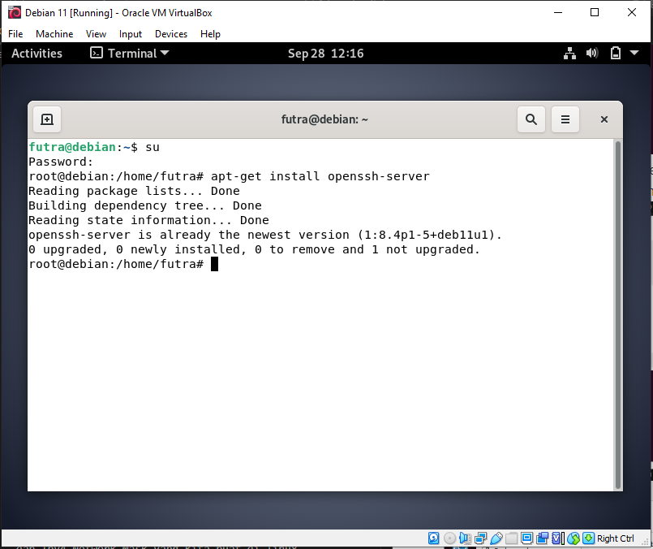
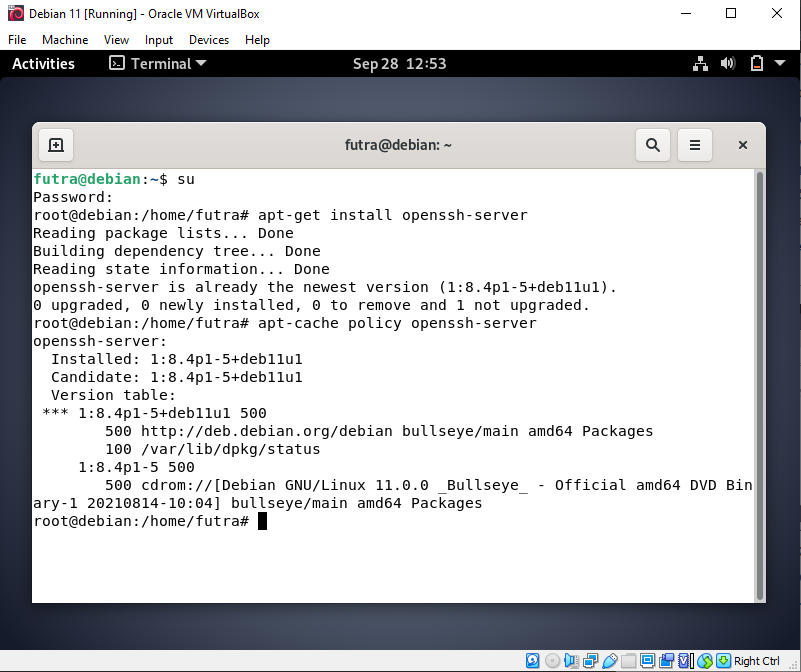
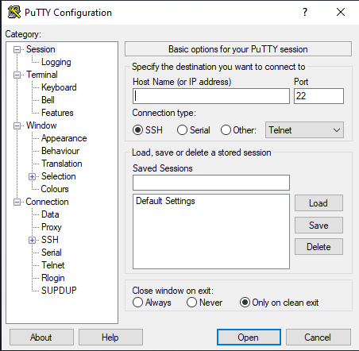
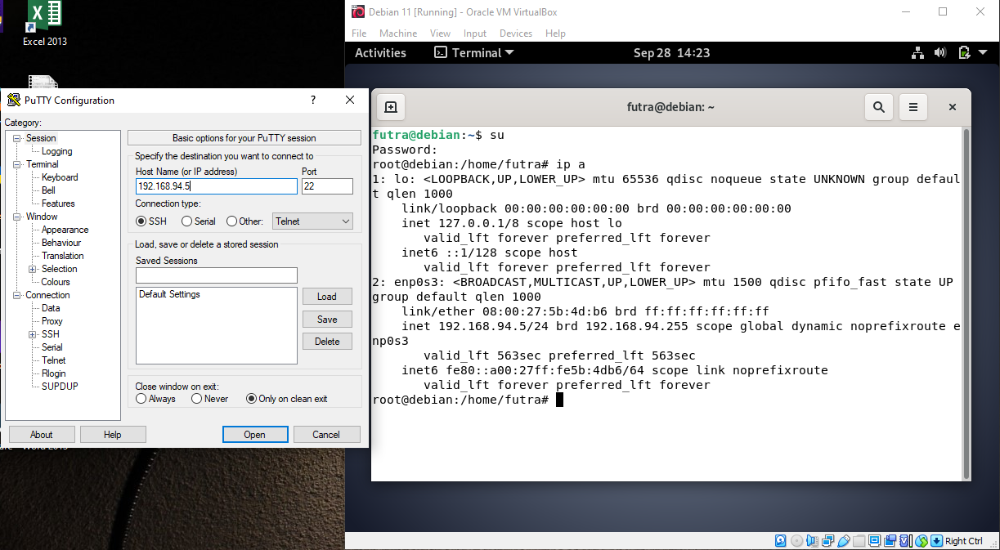
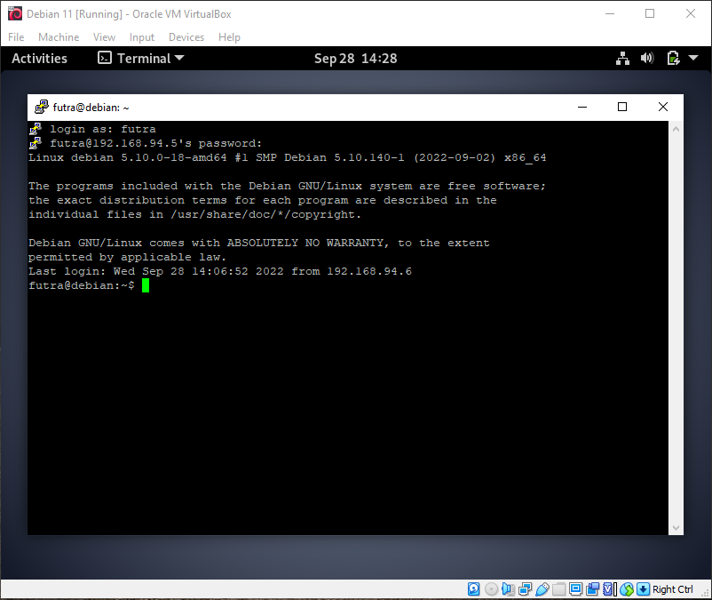

## Remote Access Using Debian
> **Nama Kelompok:**
> 1. Futra S Hutasoit (2010131210002)
> 2. Muhammad Iman Rizqullah (2010131210017)
> 3. Muhammad Riza Nugroho (2010131210005)

**1. Instalasi**
+ Langkah pertama buka Debian kemudian masuk ke super user dengan command **su** dan masukkan password Linuxnya. Jika authentication failure silahkan menggunakan command **sudo -i** dan masukkan password Linuxnya.
+ Setelah berhasil masuk ke super user, silahkan install  SSH 
(Secure Shell) dengan menjalankan command **apt-get install openssh-server**.

+ Untuk memverifikasi package silahkan menggunakan command **apt-cache policy openssh-server**

+ Untuk instalasi SSH (Secure Shell) sudah berhasil

**2. Testing**
+ Pada tahap testing ssh server akan dilakukan dari computer client, kali ini computer client menggunakan system operasi windows, untuk itu kita membutuhkan aplikasi tambahan yaitu Putty, untuk mendownloadnya silahkan akses <ins>https://www.chiark.greenend.org.uk/~sgtatham/putty/latest.html</ins>. Jika sudah mendownload, silahkan install dan jalankan.

+  Selanjutnya masukkan alamat IP address yang kita gunakan (cek IP address dengan menjalankan command **ip a**). Kali ini saya menggunakan port bawaan dari sshnya yaitu port 22, tetapi jika ingin mengubah port yang digunakan anda bisa mengeditnya pada file konfigurasi utama pada ssh server.

+ Masukkan nama user di Debian/Ubuntu/dll dan passwordnya.

+ Selamat computer server anda berhasil diremote dengan computer client.
