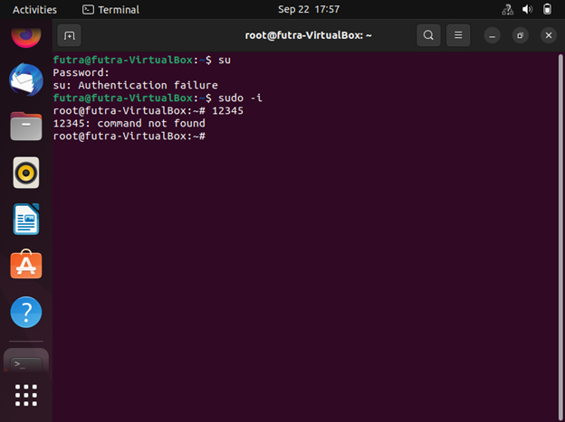

# TUGAS 2 Administrasi Sistem

---------------------------------

**Nama Kelompok:**

1. Futra Sanjaya Hutasoit (2010131210002)
2. Muhammad Iman Rizqullah (2010131210017)
3. Muhammad Riza Nugroho (2010131210005)
   
---

# (1) Client Server pada Linux Virtual Box dengan Windows.

1. Langkah pertama buka Linuxnya di VirtualBox  kemudian masuk ke super user dengan command “su” dan masukkan password Linuxnya. Jika authentication failure silahkan menggunakan command “sudo -i” dan masukkan password Linuxnya.

---

2. Kemudian buka wired settings dengan mengklik yang dilingkaran merah.
.png)
.png)

---

3. Karena kita akan menyetting secara manual jadi pilih yang manual. Untuk addresses sebagai percobaan sesuaikan saja dengan gambar atau bisa juga ip jaringannya diganti susuai keinginan. Perlu di perhatikan untuk ip jaringan address dan gatewaysebaiknya disamakan saja, pada gambar saya membuatnya 10 kemudian apply.
.png)

---

4. Setelah melakukan tahap yang di atas, sekarang buka linuxnya dan jalankan comman “ip a” maka ip address yang sudah kita buat tadi akan tampil.
.png)
.png)

---

5. Setelah itu buka VirtualBox lalu klik Host Network Manager lalu create host baru. Setelah menambahkan host buka properties dan klik adapter, karena kita menyettingnya secara manual jadi kita konfigurasi adapternya secara manual juga. Untuk IPv4 Addressnya isi sesuai ip getaway dan Ipv4 Network Mask yang kita buat di linux tadi. Jika anda mengikuti langkah-langkah sama dengan yang saya buat silahkan untuk disesuaikan dengan gambar jika sudah apply.
.png)
.png)

---

6. Kemudian buka settings lalu pilih network, pada attached to pilih hot-only adapter dan host yang baru kita buat tadi lalu klik ok.
.png)
.png)

---

7. Sekarang kita mengatur IP Address yang ada di windows dengan cara membuka network connections kemudian klik host yang sudah kita buat tadi dan buka properties. Pada properties klik internet protocol version 4.
.png)
.png)

---

8. Pilih yang Use the Following IP Address lalu isi IP addres dengan getaway yang di linux tadi dan default getaway isi dengan IP Address yang ada di Linux, untuk subnet mask disamakan saja.
.png)

---

9.  Untuk mengetahui berhasil atau tidaknya, ping ip windows di linux dengan cara “ping (IP Address windos)”. Supaya bisa berjalan pastikan fire wall & network protection dinonaktifkan.
.png)
.png)
.png)
.png)

---

10.   Selanjutnya ping ip linux di windows dengan cara “ping (IP Address Linux)”.
.png)

# (2) Client-Server pada 2 PC/Laptop menggunakan kabel LAN.

