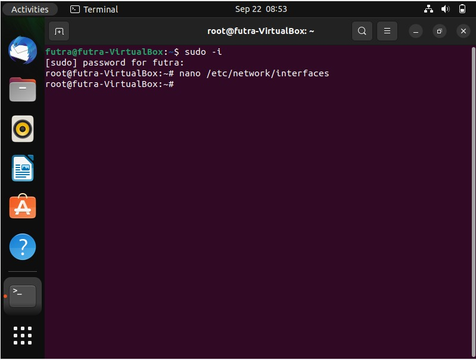

# TUGAS 2 Administrasi Sistem

---------------------------------

**Nama Kelompok:**

1. Futra Sanjaya Hutasoit (2010131210002)
2. Muhammad Iman Rizqullah (2010131210017)
3. Muhammad Riza Nugroho (2010131210005)
   
---

# (1) Client Server pada Linux Virtual Box dengan Windows.

- Langkah 1

Buka terminal, ketik su, masukkan password debian, lalu ketik nano /etc/network/interfaces.

---

- Langkah 2
.jpeg)
Masukkan syntax sesuai dengan pada gambar diatas.

---

- Langkah 3
.jpeg)
Lalu ketikkan ip a, untuk mengecek enp0s 3.

---

- Langkah 4
.jpeg)
Masuk ke settingan ubuntu/debian, atur network, dan ikuti pada gambar diatas.

---

- Langkah 5
.jpeg)
Masuk ke Control Panel, pilih Network and Internet, pilih Network Connections, lalu pilih Change Adapter Settings.

---

- Langkah 6
.jpeg)
Pilih dan masuk ke properties dari VirtualBox Host-Only Network #2. Pilih Internet Protocol Version 4 (TCP/IPv4).

---

- Langkah 7
.jpeg)

---

- Langkah 8
.jpeg)
Ketik ping dari ip address dari windows, lalu ketik enter. Dan akan keluar hasilnya seperti pada gambar diatas.

---

- Langkah 9
.jpeg)
Ketik ping dari ip address dari linux, lalu ketik enter. Dan akan keluar hasilnya seperti pada gambar diatas.

# (2) Client-Server pada 2 PC/Laptop menggunakan kabel LAN.

