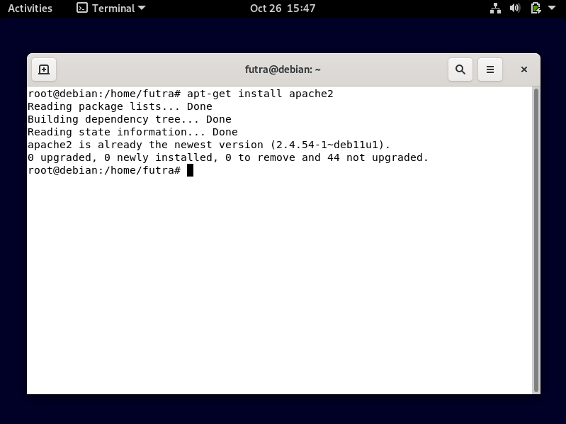
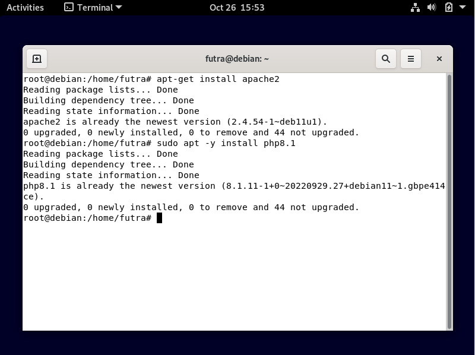
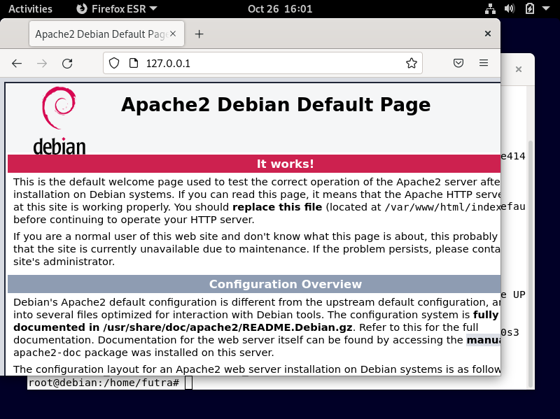
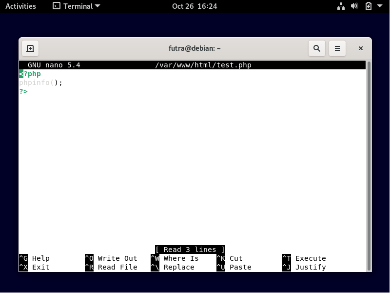
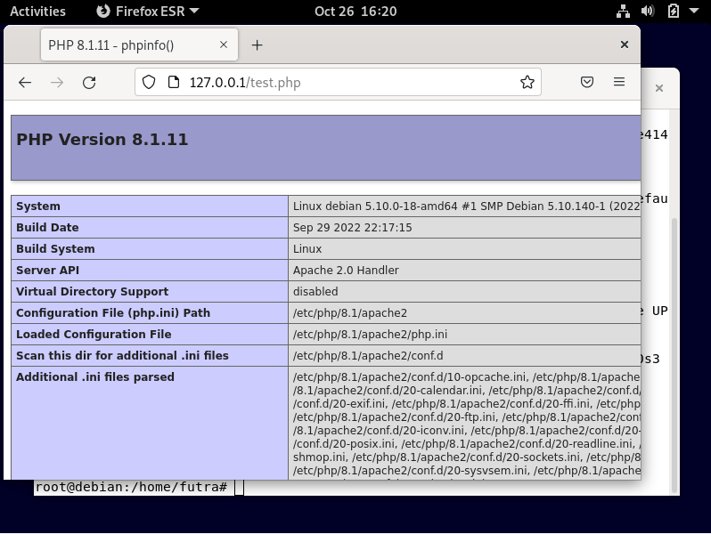

## FILE TRANSFER PROTOCOL (FTP)
> **Nama Kelompok:**
> 1. Futra S Hutasoit (2010131210002)
> 2. Muhammad Iman Rizqullah (2010131210017)
> 3. Muhammad Riza Nugroho (2010131210005)

**1. Instalasi**
+ Login ke debian dengan menggunakan user root dengan cara menjalankan command **su** atau **sudo -i** setelah itu jalankan command **apt-get install apache2** untuk menginstall **apache**.

+ Jika sudah, lanjut menginstall Bahasa pemrograman php dengan cara menjalankan command **apt-get install php8.1**(php8.1 artinya php versi 8.1) jika gagal coba jalankan command **sudo apt -y install php8.1**.

+ Selanjutnya konfigurasi, kita bisa melihat hasilnya dengan mengunjungi web browser dan mengetikkan alamat IP server kita (jalankan command **ip a** untuk melihat IP server). Maka akan muncul seperti gambar dibawah ini

+ Untuk modul ini kita akan menguji menggunakan script php untuk menampilkan info php pada server kita, Kita akan membuat skrip php pada folder **/var/www**. Silahkan jalankan command **nano /var/www/html/test.php**. Setelah itu masukkan skrip seperti pada gambar dibawah

+ Silahkan buka browser dalam linuxnya lalu ketikkan **(IP server kalian)/test.php**. Maka akan muncul laman tentang info dari php yang kita install pada server

+ Selamat bagi anda yang sudah berhasil, untuk yang belum semangat untuk mencoba lagi.